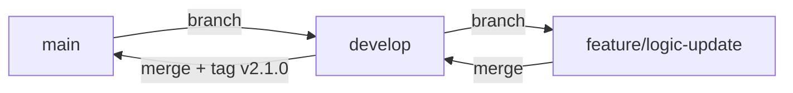

# Standard Workflow — 工程標準作業規範

> 版本：1.0.0 | 維護者：Engineering Team | SSOT：GitHub

---

## 1. 專案命名準則（kebab-case）

所有 repository、資料夾、檔案名稱一律使用 **kebab-case**。

### 規則

| 類型 | 正確 ✅ | 錯誤 ❌ |
|------|---------|---------|
| Repository | `engineering-playbook-system` | `EngineeringPlaybook`, `engineering_playbook` |
| 資料夾 | `user-service`, `api-gateway` | `UserService`, `userService` |
| Python 模組 | 使用 `snake_case`（語言慣例） | — |
| 設定檔 | `docker-compose.yml` | `DockerCompose.yml` |

### 原則

- 全小寫，單字間以 `-` 連接
- 名稱應具描述性，避免縮寫（除非業界通用，如 `api`, `db`）
- 版本號不放入名稱，改用 Git tag 管理

---

## 2. Git Flow 分支策略



## 3. Git Commit 規範（Conventional Commits）

遵循 [Conventional Commits 1.0.0](https://www.conventionalcommits.org/) 規範。

### Commit 格式

```
<type>(<scope>): <subject>

[optional body]

[optional footer]
```

### Type 定義

| Type | 用途 | 範例 |
|------|------|------|
| `feat` | 新增功能 | `feat(api): add /health endpoint` |
| `fix` | 修復 bug | `fix(logger): correct log level for warnings` |
| `docs` | 文件變更 | `docs(playbook): add git commit guidelines` |
| `refactor` | 重構（不影響功能） | `refactor(demo): extract logger to module` |
| `test` | 新增或修改測試 | `test(api): add health endpoint unit test` |
| `chore` | 建置工具、依賴更新 | `chore: upgrade fastapi to 0.110.0` |
| `ci` | CI/CD 設定變更 | `ci: add github actions workflow` |

### 規則

- `subject` 使用英文，動詞開頭，首字母小寫，不加句號
- 單次 commit 只做一件事（Single Responsibility）
- Body 說明「為什麼」而非「做了什麼」
- Breaking change 在 footer 加上 `BREAKING CHANGE:` 標記

### 範例

```
feat(demo): add structured logging with request id

Adds correlation ID to every log entry to enable
distributed tracing across services.

Closes #12
```

---

## 3. 環境安全準則

### 3.1 Secrets 管理

- **絕對禁止** 將任何 secret、token、密碼 commit 進 repository
- 使用 `.env` 檔案管理本地環境變數，並確保 `.env` 已列入 `.gitignore`
- 正式環境 secrets 透過 **GitHub Actions Secrets** 或專用 Secrets Manager 注入

```bash
# .gitignore 必須包含
.env
.env.*
*.pem
*.key
```

### 3.2 環境分層

| 環境 | 設定來源 | 說明 |
|------|---------|------|
| Local | `.env`（不 commit） | 開發者本機 |
| CI | GitHub Actions Secrets | 自動化測試 |
| Production | Secrets Manager / Vault | 正式部署 |

### 3.3 依賴安全

- 定期執行 `pip audit` 或 `npm audit` 檢查已知漏洞
- 鎖定依賴版本（`requirements.txt` 使用 `==` 而非 `>=`）
- 不使用來源不明的第三方套件

### 3.4 Code Review 安全檢查清單

在 PR 合併前確認：

- [ ] 無 hardcoded credentials
- [ ] 無敏感資料出現在 log 輸出
- [ ] 輸入驗證已實作（API 層）
- [ ] 依賴版本已鎖定

---

*所有規範變更須透過 Pull Request，並取得至少一位 reviewer 核准。*
