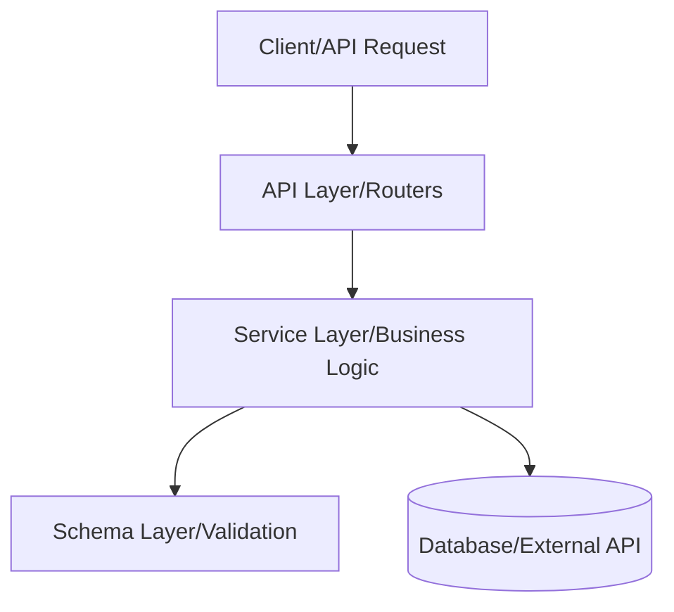
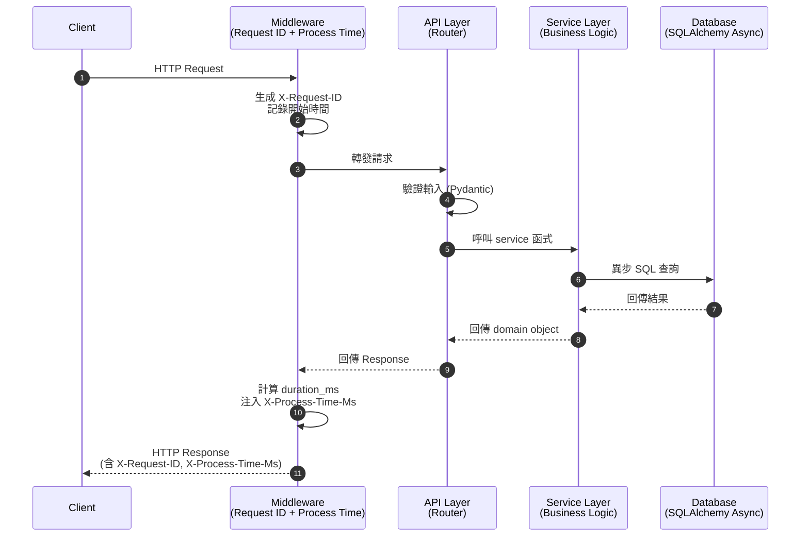
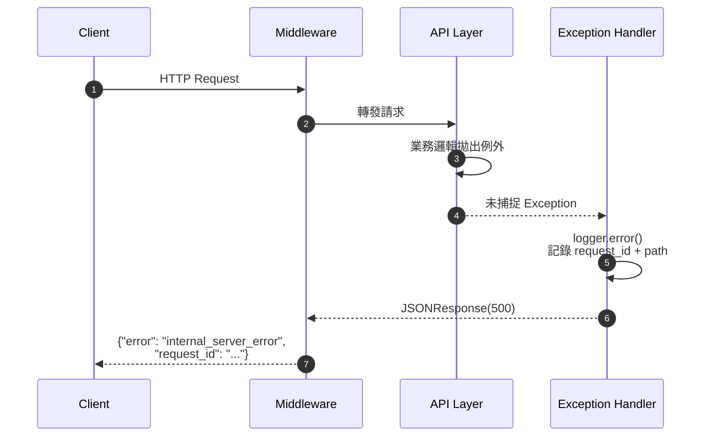

# Architecture & Quality — 架構規範與品質標準

> 版本：1.0.0 | SSOT：GitHub

---

## 1. 專案架構規範

### 標準目錄結構

```
your-service-name/
├── app/
│   ├── __init__.py
│   ├── main.py            # FastAPI 入口、middleware、exception handler
│   ├── logger.py          # 統一 logging 模組
│   └── config/
│       ├── __init__.py
│       └── settings.py    # pydantic-settings 環境變數管理
├── tests/
│   ├── __init__.py
│   └── test_health.py     # pytest 測試
├── .env.example           # 環境變數範本（可 commit）
├── .env                   # 實際環境變數（禁止 commit）
└── requirements.txt       # 鎖定版本依賴
```

### 資料流架構圖



### 分層原則

| 層級 | 職責 | 禁止事項 |
|------|------|---------|
| `main.py` | 路由定義、middleware、exception handler | 不放業務邏輯 |
| `config/` | 環境變數讀取與驗證 | 不放預設 secret |
| `tests/` | 單元測試、整合測試 | 不依賴外部服務（使用 mock） |

### 請求生命週期時序圖



### 錯誤路徑時序圖



---

## 2. 錯誤處理機制

### 原則

1. **所有 API 錯誤回傳 JSON**，絕不回傳 HTML 錯誤頁面
2. **區分 operational error 與 programmer error**
   - Operational：預期內的錯誤（404、422），用 `HTTPException`
   - Programmer：未預期例外，由 global exception handler 捕捉
3. **錯誤訊息不洩漏內部細節**（stack trace 只寫進 log，不回傳給 client）

### 錯誤回應格式（統一）

```json
{
  "error": "error_code_in_snake_case",
  "detail": "人類可讀的說明",
  "request_id": "optional-correlation-id"
}
```

### 實作範例

```python
from fastapi import FastAPI, HTTPException, Request
from fastapi.responses import JSONResponse

app = FastAPI()

# 1. Global exception handler — 捕捉所有未處理例外
@app.exception_handler(Exception)
async def global_exception_handler(request: Request, exc: Exception) -> JSONResponse:
    logger.error("Unhandled exception | path=%s | error=%s", request.url.path, exc)
    return JSONResponse(
        status_code=500,
        content={"error": "internal_server_error", "detail": "An unexpected error occurred"},
    )

# 2. 業務邏輯中使用 HTTPException
@app.get("/items/{item_id}")
async def get_item(item_id: int):
    if item_id <= 0:
        raise HTTPException(status_code=400, detail="item_id must be positive")
```

### HTTP 狀態碼使用規範

| 狀態碼 | 使用時機 |
|--------|---------|
| 200 | 成功讀取 |
| 201 | 成功建立資源 |
| 400 | 請求參數錯誤（client fault） |
| 401 | 未認證 |
| 403 | 已認證但無權限 |
| 404 | 資源不存在 |
| 422 | 請求格式正確但語意錯誤（FastAPI 預設驗證錯誤） |
| 500 | 伺服器內部錯誤（server fault） |

---

## 3. 日誌追蹤標準

### Log 等級定義

| 等級 | 使用時機 | 範例 |
|------|---------|------|
| `DEBUG` | 開發除錯，不上正式環境 | 變數值、SQL query |
| `INFO` | 正常業務事件 | 請求進入、服務啟動 |
| `WARNING` | 非預期但可恢復的狀況 | 重試、降級 |
| `ERROR` | 需要人工介入的錯誤 | 例外捕捉、外部服務失敗 |

### Log 格式規範

```
YYYY-MM-DDTHH:MM:SS | LEVEL    | module.name | message | key=value
```

範例：
```
2026-04-05T10:30:00 | INFO     | app.main | Health check requested | uptime=42.5s
2026-04-05T10:30:01 | ERROR    | app.main | Unhandled exception | path=/items/0 | error=ValueError
```

### 結構化 Log 規則

- 使用 `key=value` 格式附加上下文，方便 log aggregator 解析
- 每個請求應包含 `path`、`method`、`status_code`、`duration_ms`
- 敏感資料（密碼、token）**絕對不可出現在 log 中**
- 使用 `ProcessTimeMiddleware` 自動記錄每個請求的處理耗時

### Middleware 實作（ProcessTimeMiddleware）

```python
import time
from fastapi import Request

@app.middleware("http")
async def process_time_middleware(request: Request, call_next):
    start = time.perf_counter()
    response = await call_next(request)
    duration_ms = round((time.perf_counter() - start) * 1000, 2)
    response.headers["X-Process-Time-Ms"] = str(duration_ms)
    logger.info(
        "Request completed | method=%s | path=%s | status=%d | duration_ms=%.2f",
        request.method, request.url.path, response.status_code, duration_ms,
    )
    return response
```

---

## 4. 品質門檻（Quality Gates）

在 PR 合併前，所有項目必須通過：

- [ ] `pytest` 測試全數通過
- [ ] 無 hardcoded credentials
- [ ] 所有 API 錯誤回傳 JSON 格式
- [ ] Log 中無敏感資料
- [ ] `requirements.txt` 版本已鎖定（使用 `==`）

---

*架構決策變更須更新本文件，並透過 PR 審查。*
